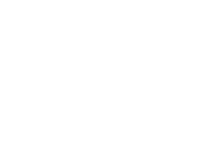
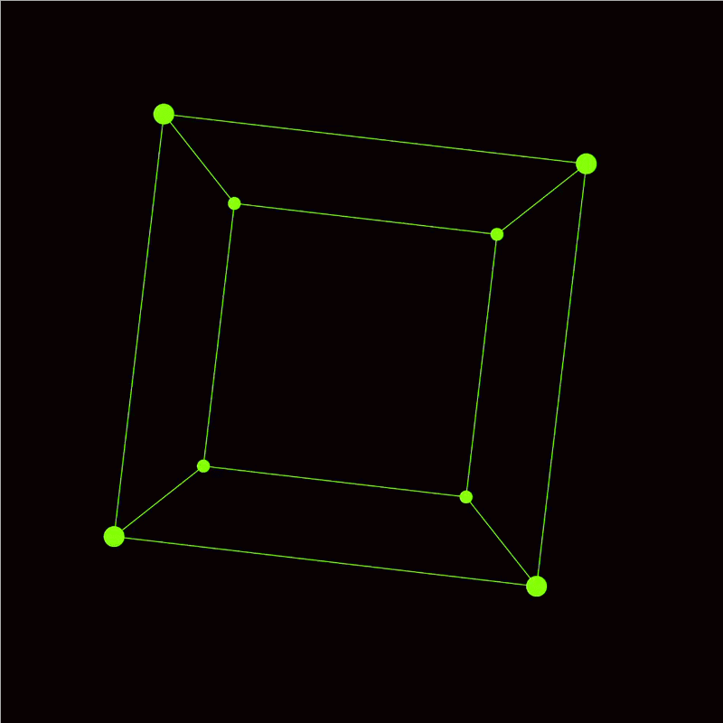
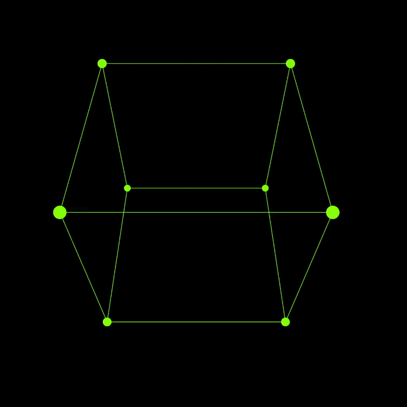
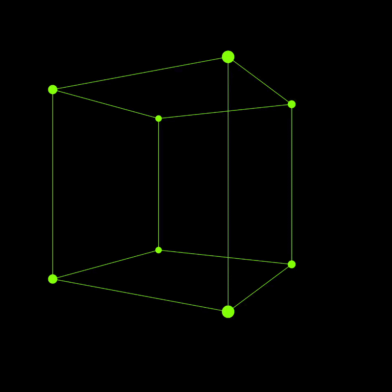
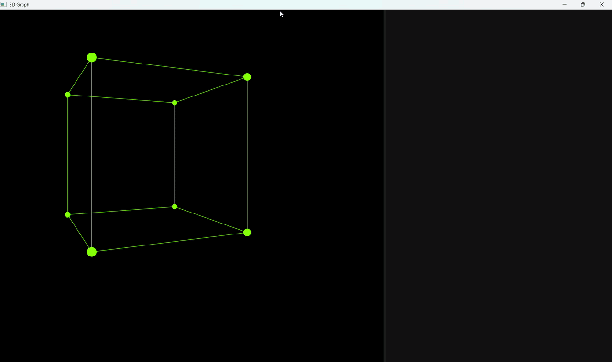

<p align="center">
    
</p>

<p align="center">
    <h1 align="center">Graph — A JavaFX 3D Rendering Engine</h1>
</p>

<p align="center">
  <em><code>❯ Interactive 3D Graph Visualizer built in Java</code></em>
</p>

<div align="center">
    
    
    
    
</div>
 
---


# Graph — A JavaFX 3D Rendering Engine

An experimental lightweight 3D rendering engine built from scratch in **Java 21** and **JavaFX 21**. It implements its own perspective projection pipeline (no `PerspectiveCamera`, no `Mesh` — just math) and renders a rotating wireframe cube on a 2D `Canvas`.

---

## 📸 Screenshots & Demo






<p align="center">
  
</p>

---

## ✨ Features

- Custom **3D → 2D perspective projection** engine
- Manual **transformation pipeline**: translate, rotate X / Y / Z
- Pluggable rendering system based on a `Renderable` interface
- `SplitPane` layout — render surface on the left, control panel on the right (reserved for future UI controls)
- Frame-driven render loop using `AnimationTimer`
- Dark theme via CSS

---

## 🧱 Tech Stack

| Component | Version |
|---|---|
| Java | 21 |
| JavaFX | 21.0.6 |
| ControlsFX | 11.2.1 |
| JUnit Jupiter | 5.12.1 |
| Build Tool | Maven (wrapper included) |

---

## 🚀 Getting Started

### Prerequisites

- **JDK 21** (or newer)
- A terminal — no need to install Maven globally, the wrapper handles it

### Clone

```bash
git clone https://github.com/Neil-Tomar/Graphy
cd Graph
```

### Run

**Linux / macOS**
```bash
./mvn clean javafx:run
```

**Windows**
```bash
mvn.cmd clean javafx:run
```

The `javafx-maven-plugin` is preconfigured with `org.example.graph.app.Launcher` as the main class.

### Build a Native Image

```bash
./mvn clean javafx:jlink
```

This produces a self-contained runtime image named `app` (see `pom.xml`).

---

## 🗂️ Project Structure

```
src/main/java/org/example/graph/
├── app/
│   ├── Launcher.java          # JVM entry point — bootstraps JavaFX runtime
│   └── WindowInitialize.java  # Creates the primary Stage and Scene
├── config/
│   └── Screen.java            # Global screen / FOV configuration
├── model/
│   ├── Pointable.java         # Base interface for point-like objects
│   ├── Point.java             # 2D point (screen space)
│   └── Point3D.java           # 3D point (model space) + Renderable
├── object/
│   ├── Cube.java              # 8 vertices + 12 edges, self-rendering
│   └── CubeType.java          # Reserved for future cube variants
├── projection/
│   ├── Animation.java         # translateZ, rotateX/Y/Z transformations
│   └── Project.java           # 3D → 2D perspective + screen mapping
├── render/
│   ├── Renderable.java        # Contract for anything drawable
│   └── Render.java            # The render engine (loop, clear, draw)
└── window/
    ├── MainWindow.java        # Root BorderPane with SplitPane layout
    ├── RenderView.java        # Canvas surface + AnimationTimer loop
    └── ControlPanel.java      # Right-side panel (UI controls TBD)
```

Plus a legacy `HelloApplication.java` — a snowfall tutorial demo kept for reference.

---

## 🔁 Render Pipeline

The transformation flow for every vertex, every frame:

```
3D Model Space
      │
      ▼
  Rotation        ── Animation.rotateX / rotateY / rotateZ
      │
      ▼
  Translation     ── Animation.translateZ
      │
      ▼
  Projection      ── Project.render   (perspective divide using FOV / z)
      │
      ▼
  Screen Mapping  ── Project.screen   (normalized [-1, 1] → pixels)
      │
      ▼
   Canvas Draw    ── GraphicsContext.fillArc / strokeLine
```

The main loop lives in `Render.onUpdate()`:

1. `clear()` — repaint the canvas black
2. Iterate over all registered `Renderable` objects and call `render(g)`
3. `updateValues()` — bump the rotation angle for the next frame

---

## 🧩 Extending the Engine

To add a new object to the scene, implement `Renderable` and register it with the engine:

```java
public class Pyramid implements Renderable {
    @Override
    public void render(GraphicsContext g) {
        // your transformation + projection + draw code
    }
}
```

```java
// In RenderView.start()
render.addObject(new Pyramid());
```

---

## 🛠️ Planned Features

Things on the workbench — some already hinted at by `TODO`-style comments in the source:

- [ ] Refactor `Cube` and `Project` (flagged in source comments)
- [ ] Wire up `ControlPanel` for live FOV / rotation / object controls
- [ ] Add more primitives — pyramid, sphere, tetrahedron, custom meshes
- [ ] Mesh loader for `.obj` files
- [ ] Backface culling and depth sorting (painter's algorithm to start)
- [ ] Filled / shaded polygons in addition to wireframe
- [ ] Basic lighting model (flat → Gouraud)
- [ ] Make `Screen` dimensions actually drive the projection (currently hardcoded `730` in `Project.screen`)
- [ ] Use `CubeType` to switch between wireframe / solid / point-only rendering
- [ ] Mouse-drag camera orbit and scroll-to-zoom
- [ ] FPS counter and debug overlay
- [ ] Unit tests for the projection and rotation math

---

## 🙋 Author

Built by [**Neil-Tomar**](https://github.com/Neil-Tomar/) — exploring 3D graphics from first principles.
